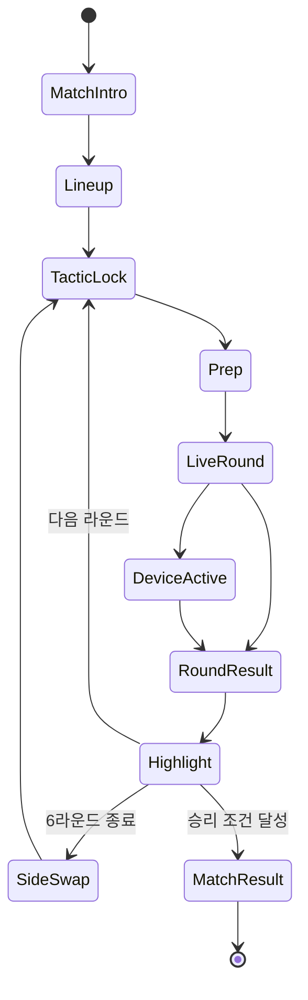

# 전술 FPS 대회 관전 UI 흐름·디자인 설계서

> 문서 ID: FMS-UI-001  
> 버전: 1.0 / 디자인 구현 기준선  
> 관점: 전술 FPS e스포츠 옵저버·방송 그래픽 디렉터  
> 대상 화면: 웹 기반 16:9 탑뷰 경기 중계, 구단 감독 관전  
> 연동 문서: `FPS_MATCH_IMPLEMENTATION_SPEC_KO.md`, `FPS_MATCH_IMPLEMENTATION_WORK_BREAKDOWN_KO.md`

---

## 0. 디자인 선언

이 화면은 플레이 HUD가 아니라 **경기를 이해시키는 방송 그래픽**이다. 시청자가 선수 대신 조준할 필요는 없지만, 왜 한 선수가 유리한지와 다음 3초에 어디서 충돌할지는 읽을 수 있어야 한다.

핵심 문장: **“정보는 가장자리에 고정하고, 사건은 중앙에서 숨 쉬게 한다.”**

### 디자인 목표

1. 3초 안에 점수, 시간, 생존 인원, 목표 상태를 읽는다.
2. 1초 안에 현재 교전 선수와 오퍼레이터를 구분한다.
3. 카메라 컷이 바뀌어도 팀, 층, 방, 공수 관계를 잃지 않는다.
4. 선수의 경기력이 오퍼레이터 아이콘에 묻히지 않는다.
5. 긴장도는 정보의 크기와 움직임으로 표현하고 화면 전체 경고색 남용을 피한다.

### 하지 않을 것

- 상용 게임의 HUD 형상, 아이콘, 서체, 색 배치를 그대로 재현하지 않는다.
- 군용 단말기처럼 보이기 위한 가짜 스캔라인, 무의미한 좌표, 육각형 장식을 남발하지 않는다.
- 모든 선수의 모든 수치를 항상 펼쳐 놓지 않는다.
- 킬마다 화면 전체를 흔들거나 번쩍이지 않는다.
- 공수 역할이 바뀔 때 팀 고유색까지 뒤집지 않는다.

공식 시즈 방송에서 검증된 상단 점수·시간, 양측 5인 정보, 포커스 선수의 장비·위치 표기라는 정보 구조는 참고하되 본 프로젝트의 탑뷰와 감독 역할에 맞게 다시 설계한다. 공식 경쟁 구조는 시즌별로 갱신될 수 있으므로 경기 포맷 수치는 별도 규칙 데이터로 둔다. 참고: [Ubisoft BLAST R6 2026 글로벌 규정](https://staticctf.ubisoft.com/p0f8o8d25gmk/4vLmovz8mJb3XUEdtHZBJA/1227a0d321ed95d3564499afb713c9d5/Global_Rulebook_BLASTR6_Season_2026_Kickoff_Update_v2.pdf), [공식 스코어보드 개선 설명](https://www.ubisoft.com/en-ca/game/rainbow-six/siege/news-updates/seasons/northstar), [공식 옵저버 슬롯 확대 설명](https://www.ubisoft.com/en-gb/esports/rainbow-six/siege/news-updates/3pZvuMbJWa8KoMGvDJIY0p/unveiling-the-rainbow-six-esports-year-7-roadmap).

---

## 1. 전체 관전 흐름



### 흐름 원칙

- 장면이 바뀌어도 상단의 팀명·점수는 같은 위치에 유지한다.
- 경기 중 화면 전환은 페이지 이동이 아니라 HUD 상태 변화로 느껴져야 한다.
- 새로운 정보는 `등장 → 강조 → 안정 → 퇴장` 네 단계로 표현한다.
- 경기 결과보다 한 단계 앞선 원인을 보여준다: 진입 준비→접촉→교전→결과.
- 사용자의 수동 관전 입력은 카메라만 바꾸고 UI 상태·경기 판정은 바꾸지 않는다.

---

## 2. 화면별 UI 흐름

## 2.1 경기 인트로

### 목표

두 팀과 경기의 중요도를 6~10초 안에 전달한다.

### 화면 결과

- 중앙: 팀 엠블럼, 팀명, 시즌 순위 또는 시드, 대결 표식.
- 상단 소형: 대회명, 스테이지, 매치 형식, 맵 순서.
- 하단: 최근 맞대결이나 핵심 서사 한 줄. 사실 데이터가 없으면 표시하지 않는다.
- 배경: 경기 맵의 저채도 탑뷰 또는 경기장 그래픽. 선수 얼굴 합성 배경은 별도 에셋이 있을 때만 사용한다.

### 전환

- 400 ms 페이드 인 → 4초 유지 → 엠블럼이 좌우 상단 팀 슬롯으로 이동 → 라인업 화면.
- 장식 애니메이션은 800 ms 이내, 텍스트는 움직이지 않고 명도만 전환한다.

### 실패 지점

- 모든 선수·순위·전적을 첫 화면에 넣어 핵심 대결이 약해짐.
- 가짜 통계나 빈 데이터 자리를 `0`으로 표시함.

### 검수 기준

- 5초 노출 후 테스트 사용자가 팀명, 경기 단계, 매치 형식을 기억한다.
- 데이터 없는 항목은 빈 카드가 아니라 레이아웃 자체에서 제거된다.

## 2.2 라인업·오퍼레이터 구성

### 목표

선수와 선택한 오퍼레이터를 연결하고 팀의 전술 의도를 예고한다.

### 화면 결과

| 영역 | 내용 |
|---|---|
| 좌·우 팀 열 | 선수 5명: 닉네임 우선, 등번호, 주 역할 |
| 선수 옆 | 오퍼레이터 콜사인, 역할 아이콘, 고유 장비 실루엣 |
| 중앙 | 예상 진입/수비 성향 3개 이하: 속공, 정보전, 지역 차단 등 |
| 하단 | 맵, 목표 구역, 공수 표시 |

- 선수 닉네임은 오퍼레이터 이름보다 1단계 크게 표시한다.
- 금지·중복 제한이 있는 경우 선택 슬롯 위에 결과를 작게 표시하되 상용 게임의 밴 UI를 모사하지 않는다.
- 팀 전술 평가는 확정 사실이 아니므로 “예상” 배지와 함께 표시한다.

### 전환

- 선택 확정 순서대로 카드가 120 ms 간격으로 등장한다.
- 준비 단계 진입 시 카드가 좌우 경기 로스터로 압축 이동한다.

### 검수 기준

- 5초 안에 특정 닉네임의 오퍼레이터와 역할을 찾을 수 있다.
- 오퍼레이터 초상이 없어도 실루엣·콜사인·역할 아이콘으로 식별된다.

## 2.3 준비 단계

### 목표

방어 설치와 공격 정찰의 의도를 보여주되 아직 벌어지지 않은 교전처럼 과장하지 않는다.

### 화면 결과

- 상단 타이머 옆에 `준비` 상태 칩.
- 로스터 카드에서 설치·정찰 중인 선수의 행동 아이콘만 활성화.
- 탑뷰에는 팀 지식으로 확인된 목표·카메라·진입 후보를 표시.
- 화면 하단에 현재 감독 전술의 첫 지시를 한 줄로 표기: “동측 2인 정찰 / 서측 돌파 대기”.
- 킬 피드 영역은 비워 두고 장비 설치 로그를 작게 사용한다.

### 실패 지점

- 준비 단계부터 전지적 적 위치를 진한 실루엣으로 보여 긴장감을 소모함.
- 장비 설치 10건을 모두 알림으로 띄워 정보 소음 발생.

### 검수 기준

- 준비 종료 시 시청자가 주 진입 방향과 핵심 수비 구역을 설명할 수 있다.
- 알림은 동시에 2개를 넘지 않고 반복 설치는 묶어서 표시한다.

## 2.4 일반 경기 진행

### 목표

조용한 탐색 구간에서도 팀의 공간 점유와 다음 충돌 가능성을 읽게 한다.

### 화면 결과

- 상단 스코어, 양측 로스터, 현재 층, 시간은 지속 표시.
- 월드 라벨은 닉네임과 시선 방향만 기본 노출.
- 적 정보는 보기 모드에 따라 실시간/마지막 확인/비표시로 구분.
- 카메라는 Strategic Wide 또는 Team Setup을 사용한다.
- 하단 사건 자막은 비워 중앙 전장을 넓게 유지한다.

### 검수 기준

- 화면 정지 이미지 한 장만 보고 각 팀의 주 진입 축과 목표 수비 밀집을 구분할 수 있다.
- 10명 라벨이 겹칠 때 설치자·교전자·선택 선수 우선순위가 지켜진다.

## 2.5 접촉 예고·교전

### 목표

총격이 시작되기 전에 누가 어떤 각도로 마주치는지 알려준다.

### 화면 결과

- 상호 LOS 예상 3초 이내면 해당 두 선수 카드의 외곽이 50% 밝아진다.
- 카메라는 조준 방향 앞쪽에 여백을 두고 양측과 엄폐 모서리를 포함한다.
- 실제 발사 시 탄약은 선택 선수 카드에서만 펼쳐지고 나머지는 탄창 경고 아이콘만 사용한다.
- 킬 확정 뒤 킬 피드가 등장하며 생존 인원 숫자가 180 ms 뒤 변경된다. 판정 이전 선표시 금지.

### 모션

- 접촉 예고: 180 ms 명도 상승, 반복 펄스 금지.
- 킬 카드 전환: 채도 감소 120 ms → 사망 대각 패턴 160 ms.
- 킬 피드: 160 ms 좌측 이동+페이드, 6초 유지, 180 ms 퇴장.

### 실패 지점

- 예상 접촉을 붉은 경고로 표시해 승패가 정해진 것처럼 보임.
- 탄약·반동·피해 숫자를 10명 카드 모두에 펼쳐 중앙 전장보다 UI가 강해짐.
- 사망 카드를 제거해 5대4 관계가 흐려짐.

### 검수 기준

- 전체 킬의 90% 이상에서 킬 1초 전 양측 또는 탄도 진입 방향을 확인할 수 있다.
- 사망 직후 0.5초 안에 어느 팀이 수적 우세인지 알 수 있다.

## 2.6 목표 장치 활성

### 목표

승리 조건의 중심이 사살에서 장치로 전환되었음을 즉시 전달한다.

### 화면 결과

- 중앙 상단 타이머가 장치 전용 원형/선형 타이머로 형태 전환한다.
- 설치 위치의 월드 비콘과 상단 목표 카드가 같은 형태 언어를 사용한다.
- 공격 전멸 상태에서도 장치 타이머와 방어팀 해제 가능성을 유지한다.
- 가장 가까운 해제 후보와 차단 가능한 공격 위치를 전술 미니맵에 표시한다.
- 배경 전체 적색화 대신 목표 카드의 명도와 작동음 간격으로 긴박도를 높인다.

### 검수 기준

- 장치 활성 0.5초 안에 화면을 처음 본 사용자도 활성 상태를 인지한다.
- 장치가 카메라 밖이어도 위치 층·방·남은 상태를 확인할 수 있다.
- 공격팀 0명일 때도 승리 배너가 조기 표시되지 않는다.

## 2.7 클러치

### 목표

최후 생존자의 부담과 가능한 선택지를 보여주되, 상대 위치를 선수에게 알려주는 것처럼 표현하지 않는다.

### 화면 결과

- 중앙 하단에 `1 대 3`처럼 생존 구도를 1.2초만 크게 표시한 뒤 작은 칩으로 축소한다.
- 최후 생존자 카드가 포커스 카드로 이동하고 체력·탄약·장비·현재 역할을 펼친다.
- 방송 모드의 적 실루엣은 유지하되 팀 지식 모드에서는 마지막 확인과 소리 추정만 표시한다.
- 카메라는 생존자와 가장 임박한 위협을 우선하되, 뒤쪽 제2 위협 방향을 화면 여백으로 남긴다.

### 실패 지점

- `CLUTCH!`를 반복 표시해 실제 성공 전 결과를 예고함.
- 최후 생존자만 확대해 접근 중인 다수의 각도 관계가 사라짐.

### 검수 기준

- 클러치 진입 후 2초 안에 생존 구도, 남은 시간, 장치 상태를 함께 읽을 수 있다.
- 성공 여부가 확정되기 전 승리 색·축하 모션을 사용하지 않는다.

## 2.8 라운드 종료·즉시 리플레이

### 목표

승리 팀과 이유를 먼저 확정하고, 가장 큰 승률 변화를 만든 장면으로 원인을 설명한다.

### 화면 결과

1. 0~1.2초: 승리 팀, 라운드 점수, `전멸/시간/폭발/해제` 사유.
2. 1.2~5.5초: 핵심 장면. 좌상단 `REPLAY`, 실제 경기 타이머 대신 상대 시간 표시.
3. 5.5~7초: 첫 교전·교환·목표 수행 등 지표 최대 3개.

- 리플레이 진입 때 화면을 흰색으로 번쩍이지 않는다. 160 ms 셔터 마스크와 `REPLAY` 라벨로 구분한다.
- 다음 라운드 진입 전 상단 점수 갱신을 완료한다.

### 검수 기준

- 결과 사유가 판정 이벤트와 100% 일치한다.
- 리플레이 화면이 생방송으로 오인되지 않는다.
- 지표가 실제 로그에서 재계산 가능하다.

## 2.9 공수 교대·전술 타임아웃

### 목표

경기의 큰 국면 변화를 알리면서 팀 정체성을 보존한다.

### 화면 결과

- 팀색과 좌우 위치는 유지한다.
- 검/방패 역할 아이콘이 중앙을 통과하며 서로 교체되고 `공격 ↔ 방어` 텍스트를 병기한다.
- 전술 타임아웃은 경기 화면을 버리지 않고 저채도 맵 위에 감독 지시, 선수 상태, 남은 타임아웃만 표시한다.
- 선수 웹캠이 없는 게임에서는 빈 영상 프레임을 만들지 않는다. 대신 라운드별 이동 경로와 교전 지점을 보여준다.

### 검수 기준

- 교대 직후 팀색 혼동이 없고 새 공수 역할을 1초 안에 읽는다.
- 타임아웃 종료 1초 전에 경기 HUD가 복귀해 시작을 놓치지 않는다.

## 2.10 경기 종료

### 목표

경기 결과를 구단 운영 판단으로 연결한다.

### 화면 결과

- 승리 팀과 최종 점수를 가장 먼저 표시한다.
- 선수 오브 더 매치는 킬 수만이 아니라 목표, 정보, 교환, 생존 기여의 합산 근거를 함께 표기한다.
- 팀 비교는 4개 지표만 기본 노출: 첫 교전, 교환 성공률, 설치/저지, 정보 활용.
- `상세 분석`, `선수 평가`, `다음 일정`으로 이동한다.

### 검수 기준

- 결과 화면에서 누가 이겼는지보다 숫자 그래프가 먼저 보이지 않는다.
- 선정 선수의 근거가 이벤트 로그로 설명 가능하다.

---

## 3. 라이브 HUD 레이아웃

## 3.1 1920×1080 기준 안전영역

| 슬롯 | 좌표·크기 | 레이어 | 표시 정책 |
|---|---|---:|---|
| Match Header | x 360~1560 / y 24~92 | 50 | 항상 표시 |
| Team A Roster | x 24~266 / y 120~600 | 40 | 항상 표시, 자동 축약 가능 |
| Team B Roster | x 1654~1896 / y 120~600 | 40 | 항상 표시, 자동 축약 가능 |
| Objective Bar | x 760~1160 / y 98~150 | 55 | 설치 관련 시 확장 |
| Kill Feed | x 1260~1628 / y 118~290 | 45 | 사건 발생 후 6초 |
| Focus Card | x 292~700 / y 884~1040 | 45 | 선택·교전 선수 |
| Tactical Minimap | x 1320~1628 / y 792~1040 | 35 | 접기 가능 |
| Event Caption | x 710~1210 / y 830~902 | 60 | 한 번에 1건 |
| World Labels | 전장 위 | 30 | 중요도 기반 충돌 회피 |

외곽 24 px, 중앙 전장 `x 286~1634 / y 108~1038`을 기본 보호 영역으로 둔다. 중앙 50% 너비와 60% 높이 안에는 지속형 불투명 패널을 배치하지 않는다.

### 와이어프레임 영역 관계

| 상단 | 상단 | 상단 |
|---|---|---|
| A팀 로스터 | 점수·시간·공수·목표 | B팀 로스터 / 킬 피드 |
| A팀 로스터 | **탑뷰 전장 — 지속형 패널 금지** | B팀 로스터 |
| 선수 포커스 | 사건 자막 / 자유 전장 | 전술 미니맵 |

## 3.2 반응형 규칙

| 화면 | 처리 |
|---|---|
| 1920×1080 이상 | 전체 HUD, 카드 242×76 px |
| 1366×768 | 로스터 176×54 px, 초상 축소, 장비 잔량 아이콘화 |
| 1024~1365 | 미니맵 기본 접힘, 포커스 카드 한 줄, 위치명 약칭 |
| 1024 미만 | 관전 축약 모드: 상단, 생존 5칸, 목표, 선택 선수만 |

- 텍스트 최소 12 px, 핵심 시간 18 px 이하로 축소하지 않는다.
- 패널 축소보다 정보 단계 축약을 우선한다.
- 세로 화면은 개발·밸런스용이 아니라 결과 확인용으로만 지원한다.

---

## 4. 컴포넌트 설계

## 4.1 Match Header

### 구조

`대회/맵 → 팀 A 엠블럼·이름·점수 → 라운드 타이머·상태 → 팀 B 점수·이름·엠블럼`

- 팀 이름은 12자 초과 시 약칭을 사용하고 글자 축소를 피한다.
- 점수는 가장 큰 숫자이며 팀색 배경이 아니라 중립 패널 안에 팀색 키라인을 사용한다.
- 타이머 아래에 `R7`, `연장 1`, `준비`, `장치 활성` 상태를 한 개만 표시한다.
- 공수 아이콘은 팀 슬롯 내부에 두어 어느 팀의 역할인지 분명하게 한다.

### 상태

| 상태 | 변화 |
|---|---|
| PREP | 중립 청회색 상태 칩 |
| ACTION | 시간만 강조, 움직임 없음 |
| <30초 | 타이머 명도 증가, 색 전환은 10초 이하부터 |
| DEVICE | 타이머 형태 전환, 점멸 대신 진행 감소 |
| OVERTIME | 라운드 태그에 `OT` 병기 |

## 4.2 Team Roster와 Player Card

### 카드 정보 순서

1. 생존 상태/체력 스트립.
2. 선수 닉네임과 등번호.
3. 오퍼레이터 실루엣 또는 약칭.
4. 역할 아이콘.
5. 남은 고유 장비.
6. 현재 행동은 필요할 때만 한 단어로 표시.

### 카드 상태

| 상태 | 표현 |
|---|---|
| Normal | 중립 배경, 팀색 3 px 키라인 |
| Selected | 외곽 2 px+작은 포인터, 크기 변화 없음 |
| Contact | 명도 15% 상승, 180 ms 한 번 전환 |
| Injured | 체력 스트립 분절, 십자형 상태 표식 |
| Downed | 사선 패턴, 출혈 시간 작은 링 |
| Dead | 채도 0, 대각 절단 표식, 카드 위치 유지 |
| Carrier | 장치 케이스 표식 |
| Planting/Disabling | 행동 진행선이 카드 하단에 연결 |

선수 카드의 클릭/포커스 범위는 시각 카드보다 8 px 넓게 두되 다른 카드와 겹치지 않는다.

## 4.3 Focus Card

선택 또는 자동 포커스 선수 한 명만 상세화한다.

- 1행: 닉네임, 오퍼레이터, 역할, 현재 방/층.
- 2행: 주무기 실루엣, 탄창/예비 탄약, 고유 장비.
- 3행: 현재 행동과 짧은 이유. 예: `각도 유지 — 동측 소리 확인`.
- 능력치는 숫자 대신 현재 행동에 관련된 항목 1개만 필요 시 표시한다.
- 카메라가 다른 선수로 자동 전환되어도 Focus Card는 250 ms 교차 페이드 후 바뀐다.

## 4.4 Kill Feed

- 구조: `가해 선수 → 무기/관통/지원 → 피해 선수`.
- 최대 4줄, 6초 유지. 다중 처치는 같은 가해자 그룹으로 묶는다.
- 팀킬은 별도 경고색과 양방향 표식.
- 헤드 치명타, 관통, 장비 보조는 작은 기호로 제공하되 한 줄에 2개를 넘지 않는다.
- 판정 완료 이벤트 수신 전에는 표시하지 않는다.

## 4.5 Objective Bar

- `CARRIED`, `DROPPED`, `PLANTING`, `ACTIVE`, `DISABLING`, `RESOLVED` 상태를 가진다.
- 운반·드롭은 작은 칩, 설치·해제는 400 px 폭 진행형 패널, 활성은 타이머와 결합한다.
- 설치/해제 중 행동자 닉네임과 위치를 병기한다.
- 취소 시 붉은 실패 애니메이션 대신 진행선이 120 ms 안에 접히고 취소 아이콘을 1초 표시한다.

## 4.6 Tactical Minimap

- 현재 층 평면, 방 이름, 목표, 아군, 현재 확인 적, 마지막 확인 적, 소리 추정을 표시한다.
- 팀 지식 모드에서는 미확인 적을 절대 표시하지 않는다.
- 방송 모드 적은 얇은 외곽선, 팀이 실제 확인한 적은 실색 점으로 구분한다.
- 층 전환은 탭으로 고정하고 자동 카메라 층이 바뀌면 새 탭이 1회 강조된다.
- 카메라 뷰포트 범위를 미니맵에 얇은 사각형으로 표시한다.

## 4.7 World Label

- 전략 줌: 닉네임, 팀 형태, 시선 선 3요소.
- 교전 줌: 닉네임+오퍼레이터 약칭, 체력, 장치 보유.
- 라벨은 캐릭터 머리 위 고정이 아니라 카메라 방향의 외곽 쪽으로 10~16 px 오프셋한다.
- 충돌 시 `장치 행동자 > 현재 교전자 > 선택 선수 > 마지막 생존자 > 나머지` 순으로 유지한다.
- 적의 마지막 확인 위치는 실체 라벨이 아닌 잔상 링과 경과 시간으로 표시한다.

---

## 5. 정보 모드

| 모드 | 목적 | 적 정보 | 분석 수치 | 기본 대상 |
|---|---|---|---|---|
| 방송 | 경기 전체 이해 | 양 팀 실루엣, 방송 전용 외곽선 | 최소 | 일반 관전 |
| 팀 정보 | 해당 팀이 실제로 아는 것 확인 | 확인·마지막 위치·소리 추정만 | 없음 | 전술 검수 |
| 전술 분석 | 경기 후 원인 학습 | 기록된 전체 경로 | 승률 변화·사선·타이밍 | 리플레이 |

- 모드 전환 시 화면 상단 왼쪽에 1.5초 동안 모드명을 표시한다.
- 팀 정보 모드는 반드시 관점 팀을 선택해야 하며 상단 팀 슬롯에 `관점` 배지를 붙인다.
- 분석 모드는 생방송 중 기본 비활성화한다. 사용자가 켜도 경기 판정에는 영향이 없다.

### 검수 기준

- 같은 틱의 세 모드 캡처에서 정보 차이를 육안으로 설명할 수 있다.
- 방송용 실루엣이 팀 정보 레이어에 섞이는 프레임이 없다.
- 모드 전환 전후 카메라 위치와 경기 결과가 유지된다.

---

## 6. 시각 디자인 시스템

## 6.1 톤

`편집된 스포츠 중계 60% + 현대 전술 지도 30% + 구단 브랜드 10%`

- 배경 패널은 완전 검정 대신 청회색이 섞인 숯색.
- 모서리는 2~6 px의 작은 반경을 사용하고 과도한 캡슐형 카드를 피한다.
- 장식선보다 정렬, 간격, 명도 차이로 위계를 만든다.
- 유리 효과는 최소화한다. 전장 위 패널은 불투명도 88% 이상으로 글자를 보장한다.

## 6.2 기본 토큰

```css
:root {
  --surface-0: #0B1014;
  --surface-1: #121A20;
  --surface-2: #1B252D;
  --text-1: #F2F5F7;
  --text-2: #AEBBC4;
  --line: #34434D;
  --team-a: #20B8B0;
  --team-b: #F08A3C;
  --warning: #F2C94C;
  --danger: #E35D6A;
  --success: #69C78C;
  --space-1: 4px;
  --space-2: 8px;
  --space-3: 12px;
  --space-4: 16px;
  --space-5: 24px;
  --radius-sm: 2px;
  --radius-md: 6px;
}
```

팀색은 사용자 설정으로 교체 가능해야 하며, A팀 원형/B팀 마름모 형태 표식은 유지한다. `danger`는 사망, 마지막 10초, 치명 경고에 동시에 사용하지 않고 맥락별 형태를 병기한다.

## 6.3 타이포그래피

- 숫자와 타이머: 폭이 고정된 숫자 또는 tabular numeral.
- 선수 닉네임: 굵기 650~700, 축약 우선, 자간 축소 금지.
- 위치·보조 정보: 본문보다 한 단계 낮은 명도.
- 영문 대문자는 상태 칩과 4자 이하 약칭에만 사용한다.
- 한글은 12 px 미만 사용 금지, 핵심 타이머 24~32 px.

## 6.4 아이콘

- 24 px 기본 그리드, 선 두께 1.75~2 px.
- 공수, 생존, 목표, 역할은 서로 다른 외곽 형태를 가진다.
- 총기는 실루엣, 장비는 기능 방향이 보이는 3/4 또는 탑뷰 아이콘을 사용한다.
- 의미 없는 십자선, 방패, 육각형을 장식으로 반복하지 않는다.

---

## 7. 모션과 긴장도 설계

### 긴장도 단계

| 단계 | 상황 | UI 변화 |
|---|---|---|
| 0 Calm | 준비·재배치 | 정적, 낮은 명도, 사건 자막 없음 |
| 1 Contact | 3초 내 접촉 가능 | 관련 카드 명도 상승, 카메라 완만한 줌 |
| 2 Fight | 사격 교환 | 킬 피드·포커스 탄약 활성, 컷 제한 |
| 3 Objective | 설치·해제 | 목표 바가 타이머와 결합 |
| 4 Clutch | 1대N/마지막 10초 | 생존 구도 1회 강조, 불필요 정보 축약 |
| 5 Resolve | 승패 확정 | 전장 명도 감소, 결과 카드 전면 |

### 시간 기준

- 일반 상태 전환: 120~200 ms.
- 카드 재배치: 220~320 ms.
- 장면 전환: 320~500 ms.
- 정보 강조 유지: 최소 800 ms.
- 반복 펄스: 장치 마지막 10초를 제외하고 금지.
- `prefers-reduced-motion`에서는 이동을 페이드로 대체하고 줌 속도를 절반으로 줄인다.

### 실패 지점

- 모든 사건에 같은 슬라이드 인을 사용해 중요도 차이가 사라짐.
- 긴장감을 만들려고 타이머·카드·화면 테두리를 동시에 점멸함.
- 카메라 컷과 UI 재배치가 같은 프레임에 일어나 방향 감각을 잃음.

### 검수 기준

- 카메라 컷 후 180 ms 동안 지속형 패널의 큰 재배치를 시작하지 않는다.
- 화면에서 동시에 움직이는 UI 그룹은 최대 2개다.
- 모션 감소 설정에서 정보 등장 순서와 지속 시간이 유지된다.

---

## 8. 카메라와 UI의 계약

### 카메라가 UI에 제공할 값

`cameraMode`, `focusPlayerIds`, `focusFloor`, `worldBounds`, `predictedContact`, `safeInsets`, `isReplay`.

### UI가 카메라에 제공할 값

`occupiedRects`, `selectedPlayerId`, `lockedFloor`, `viewMode`, `minimapExpanded`.

### 계약 규칙

- 카메라는 `occupiedRects` 안에 총구·표적·장치를 두지 않도록 프레이밍한다.
- UI는 카메라 확대율을 보고 정보 단계를 바꾸지만 선수 위치를 바꾸지 않는다.
- 자동 포커스는 수동 선택을 덮어쓰지 않는다. 수동 잠금 해제 또는 5초 무입력 자동 복귀 설정을 따른다.
- 리플레이 시 `isReplay=true`를 모든 시간·킬 피드·목표 컴포넌트가 사용한다.

### 검수 기준

- 장치 설치자와 총구가 지속형 패널 뒤에 가려지는 프레임이 없다.
- 카메라 회전·층 전환 뒤 월드 라벨이 한 프레임 이상 잘못된 위치에 남지 않는다.
- 수동 선수 추적 중 자동 디렉터가 강제로 대상을 바꾸지 않는다.

---

## 9. 데이터 바인딩

| 컴포넌트 | 권위 데이터 | 이벤트 | 금지된 추정 |
|---|---|---|---|
| Match Header | MatchState, AuthorityClock | ROUND_START/END | 로컬 타이머로 승패 예측 |
| Player Card | AgentRuntime | HIT/DOWN/KILL/GADGET | 애니메이션 상태로 체력 추측 |
| Kill Feed | 확정 MatchEvent | KILL | 탄착 전에 선표시 |
| Objective Bar | DeviceState | PLANT/DISABLE events | 진행 애니메이션으로 완료 판정 |
| Minimap | KnowledgeRecord/BroadcastKnowledge | SPOT/SOUND | Authority 좌표 직접 참조 |
| Focus Card | AgentRuntime+AI Intent label | FOCUS_CHANGED | 내부 디버그 점수 노출 |
| Round Result | ResolveResult | ROUND_END | 생존자 수만으로 원인 추측 |

UI 상태는 경기 데이터의 복사본이 아니라 선택·접힘·모드 같은 프레젠테이션 상태만 소유한다.

---

## 10. 예외·실패 화면

| 상황 | 처리 |
|---|---|
| 선수 데이터 지연 | 마지막 확정 상태 유지, 카드에 연결 상태 점 표시 |
| 초상 누락 | 역할 기반 실루엣과 등번호 사용 |
| 팀 로고 누락 | 팀명 첫 글자 모노그램 자동 생성 |
| 긴 닉네임 | 등록된 방송 약칭 사용, 임의 말줄임은 최후 수단 |
| 동시 다중 킬 | 동일 틱 사건 seq 순서로 그룹 표시 |
| 5명 이상 짧은 연쇄 킬 | 4줄 유지, 오래된 줄 즉시 접기 |
| 장치 상태와 UI 불일치 | Authority 상태로 즉시 교정, 진단 로그 기록 |
| 카메라 후보 없음 | 현재 층 목표 중심 Strategic Wide로 폴백 |
| 리플레이 복원 실패 | 리플레이 생략, 결과와 원인 지표만 표시 |
| 30 fps 이하 | 장식 모션·파티클 축소, 타이머·판정 갱신 유지 |

오류 상황에서도 가짜 값, 임의 선수, 잘못된 팀색을 표시하지 않는다.

---

## 11. 프로토타입 제작 순서

1. **흑백 정보 와이어프레임**: 상단, 양측 로스터, 목표, 포커스, 미니맵만 배치한다.
2. **고정 시드 영상 연결**: 준비→교전→설치→클러치→종료 한 라운드로 모든 상태를 검증한다.
3. **정보 모드 분리**: 방송/팀 정보/분석을 같은 프레임에서 비교한다.
4. **카메라 계약 적용**: UI 점유 영역과 카메라 안전 프레이밍을 연결한다.
5. **팀색·형태·서체 적용**: 흑백 가독성 승인 후 브랜드를 입힌다.
6. **모션과 사운드 적용**: 정보 전환 타이밍이 승인된 뒤 긴장도 레이어를 추가한다.
7. **1366×768 축약**: 데스크톱 기본 화면이 완료된 후 정보 우선순위로 축약한다.

프로토타입 첫 승인 조건은 장식 완성도가 아니라 **무음·흑백 상태에서 경기 흐름을 이해할 수 있는가**다.

---

## 12. 디자인 QA 체크리스트

### 정보

- [ ] 점수, 시간, 생존 인원, 목표 상태를 3초 안에 읽는다.
- [ ] 선수 닉네임이 오퍼레이터보다 우선한다.
- [ ] 팀색과 공수 역할이 별도 기호로 표현된다.
- [ ] 사망 선수 카드가 제거되지 않는다.
- [ ] 방송 정보와 팀 지식 정보가 형태로 구분된다.
- [ ] 킬·설치·해제 정보가 판정 전에 표시되지 않는다.

### 구도

- [ ] 중앙 50%×60%에 지속형 불투명 패널이 없다.
- [ ] 총구, 표적, 엄폐 모서리, 장치가 HUD에 가려지지 않는다.
- [ ] 층이 바뀔 때 현재 층과 방 이름을 0.8초 안에 읽는다.
- [ ] 1080p와 768p에서 겹침·잘림이 없다.
- [ ] 10명 라벨 충돌 시 우선순위가 지켜진다.

### 모션

- [ ] 동시에 움직이는 UI 그룹이 2개 이하이다.
- [ ] 일반 컷 직후 180 ms 동안 큰 UI 재배치가 없다.
- [ ] 반복 점멸과 전체 화면 섬광을 사용하지 않는다.
- [ ] 모션 감소 모드에서 정보 손실이 없다.

### 접근성

- [ ] 색각 필터 3종에서 팀·생존·공수를 구분한다.
- [ ] 일반 텍스트 대비 4.5:1, 큰 텍스트·아이콘 3:1 이상이다.
- [ ] 마우스 없이 선수 선택, 층 변경, 모드 전환이 가능하다.
- [ ] 음소거 상태에서도 발사·피격·목표 사건을 읽는다.

### 방송 품질

- [ ] 킬 90% 이상이 1초 전 맥락과 함께 포착된다.
- [ ] 설치·해제 100%에서 행동자·장치·위협이 보인다.
- [ ] 리플레이와 생방송이 명확히 구분된다.
- [ ] 경기 종료 화면이 킬 수만으로 선수 가치를 판단하지 않는다.

---

## 13. 최종 화면 납품 목록

| 프레임 | 필수 상태 |
|---|---|
| UI-00 | 팀 대결 경기 인트로 |
| UI-01 | 라인업·오퍼레이터 구성 |
| UI-02 | 준비 단계 전략 줌 |
| UI-03 | 일반 진행 Strategic Wide |
| UI-04 | 접촉 예고 Contact |
| UI-05 | 교전·킬 발생 |
| UI-06 | 설치 진행 |
| UI-07 | 장치 활성·해제 시도 |
| UI-08 | 1대N 클러치 |
| UI-09 | 라운드 결과 |
| UI-10 | 즉시 리플레이 |
| UI-11 | 공수 교대 |
| UI-12 | 전술 타임아웃 |
| UI-13 | 경기 종료·감독 분석 연결 |
| UI-14 | 1366×768 축약 HUD |
| UI-15 | 방송/팀 정보/분석 3모드 비교 |

각 프레임은 기본, 데이터 누락, 긴 닉네임, 사망 4명, 장치 활성, 색각 필터 상태를 포함한 컴포넌트 변형과 함께 납품한다. 개발 전달물에는 디자인 토큰, 8 px 간격 규칙, 컴포넌트 상태표, 실제 이벤트 이름, 전환 시간, 반응형 축약 규칙을 포함한다.

## 14. 최종 승인 기준

이 UI는 다음 조건을 모두 충족할 때 승인한다.

- 처음 보는 사람이 해설 없이도 한 라운드의 원인과 결과를 설명한다.
- 선수, 오퍼레이터, 팀, 공수, 생존 상태가 서로 다른 시각 채널을 사용한다.
- 조용한 전술 구간과 교전·목표·클러치의 긴장도 차이가 과장 없이 느껴진다.
- 방송 화면이 선수 AI가 가질 수 없는 정보를 명확히 방송 전용으로 표시한다.
- 탑뷰 캐릭터·총기·장비가 UI보다 작아지지 않고, 중앙 전술 행동이 항상 주인공으로 남는다.
- 상용 게임의 고유 HUD를 복제하지 않으면서 전술 FPS 대회 중계로 즉시 인식된다.
