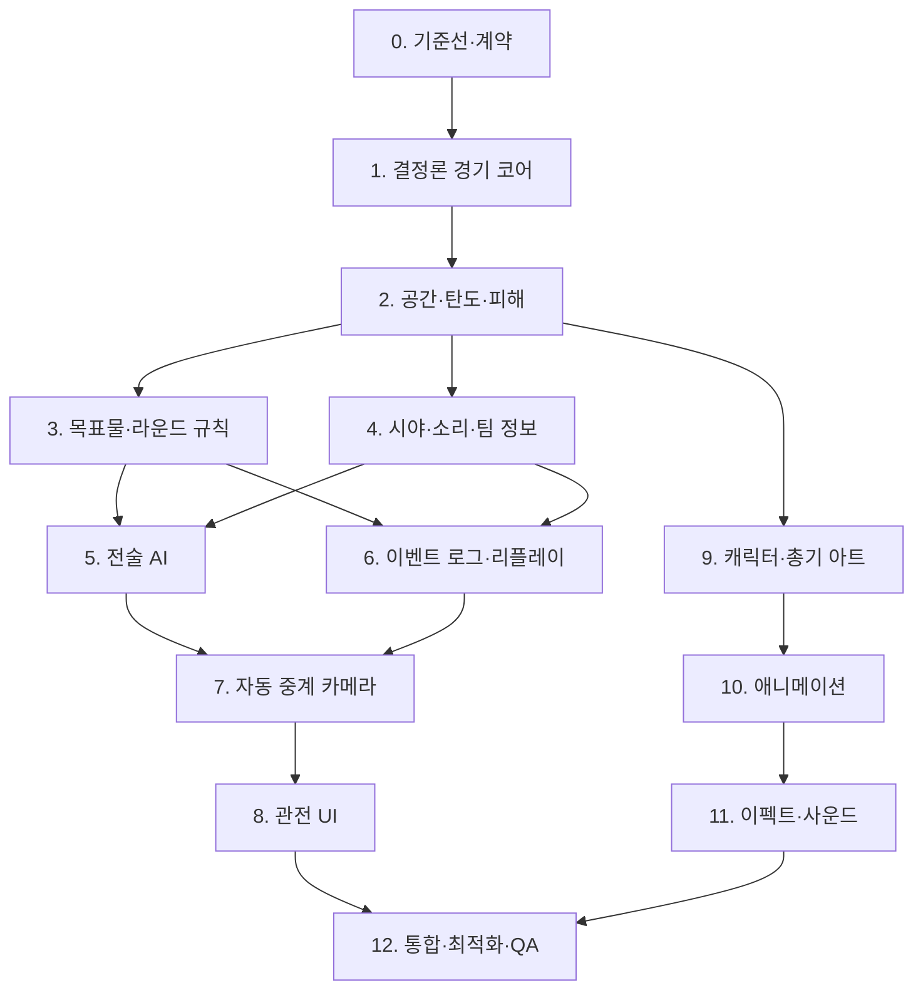

# 전술 FPS 경기 구현 작업 분해 문서

> 문서 ID: FMS-WBS-001  
> 기준 명세: `FPS_MATCH_IMPLEMENTATION_SPEC_KO.md` v1.0  
> 목적: 기능을 나열하는 대신, 다시 뜯어고치지 않도록 **의존성 순서·산출물·완료 게이트**를 고정한다.

---

## 1. 실행 원칙

- 판정이 완성되기 전에 연출을 붙이지 않는다.
- 실제 경기 상태, 팀이 아는 정보, 방송에 보여줄 정보를 별도 데이터로 유지한다.
- 한 단계가 완료 게이트를 통과해야 다음 단계가 그 결과에 의존할 수 있다.
- 임시 아트는 허용하지만 임시 판정과 임시 데이터 계약은 허용하지 않는다.
- 카메라·HUD·사운드·이펙트는 경기를 관찰할 뿐 경기 결과를 바꾸지 않는다.
- 각 단계는 `단위 테스트 → 고정 시드 시나리오 → 한 라운드 시각 확인` 순으로 검수한다.

## 2. 전체 의존성

## 3. 작업 순서 요약

| 순서 | 작업 묶음 | 선행 | 핵심 산출물 | 완료 게이트 |
|---:|---|---|---|---|
| 0 | 기준선과 데이터 계약 | 없음 | 규칙 설정, ID 체계, 이벤트 스키마, 고정 시드 러너 | 한 경기 무입력 실행 가능 |
| 1 | 결정론 경기 코어 | 0 | 20 Hz 틱, 상태 기계, 체크섬 | 100회 결과 동일 |
| 2 | 공간·이동·탄도·피해 | 1 | 충돌, LOS, 총구 탄도, 피해 상태 | 벽 관통·문 끼임 오류 0건 |
| 3 | 목표물과 승패 | 2 | 설치·해제, 시간, 공수 교대, 연장 | 모든 경계 판정 자동 테스트 통과 |
| 4 | 시야·소리·팀 지식 | 2 | 개인 인지, 정보 공유, 마지막 위치 | 전지적 좌표 누출 0건 |
| 5 | 역할·전술 AI | 3, 4 | 계획 실행, 역할 승계, 트레이드 | 100경기 교착 0건 |
| 6 | 로그·리플레이·통계 | 3, 4 | 이벤트 로그, 키프레임, 지표 집계 | 원본과 리플레이 상태 일치 |
| 7 | 자동 중계 카메라 | 5, 6 | 카메라 후보, 디렉터 점수, 컷 | 킬 선행 포착 90% |
| 8 | 관전 UI와 UX | 7 | HUD, 선수 카드, 모드 전환 | 핵심 정보 3초 판독 |
| 9 | 캐릭터·총기·장비 파이프라인 | 2 | 기준 캐릭터, 무기군, 소켓 규격 | 비율·파지 기준 통과 |
| 10 | 애니메이션 | 9 | 상·하체 분리, 전환, 행동 commit | 손 분리·발 미끄러짐 0건 |
| 11 | 이펙트·사운드·타격감 | 10 | 발사·탄착·파괴·공간음 | 판정 동기·식별 테스트 통과 |
| 12 | 통합·성능·접근성 | 8, 11 | 프리셋, 부하 테스트, 최종 QA | P0/P1 0건, 20경기 연속 완료 |

---

## 4. 단계별 실행 티켓

## 0단계 — 기준선과 데이터 계약

### 목표

개발 중 수치·ID·이벤트 의미가 바뀌어 리플레이와 UI를 반복 수정하는 일을 막는다.

### 작업

| ID | 작업 | 산출물 | 검수 |
|---|---|---|---|
| BASE-01 | 경기 규칙을 코드 밖 설정으로 분리 | `MatchRules` | 모든 시간·라운드 수 하드코딩 검색 0건 |
| BASE-02 | 팀·선수·오퍼레이터·장비 영구 ID 정의 | ID 규칙표 | 표시명 변경 후 저장·리플레이 참조 유지 |
| BASE-03 | `MatchEvent(tick, seq, type, actor, target, payload)` 확정 | 이벤트 카탈로그 | 같은 틱 순서가 항상 재현됨 |
| BASE-04 | 시드 입력형 헤드리스 경기 러너 | 자동 실행 명령 | UI 없이 한 경기 종료·결과 출력 |
| BASE-05 | 상태 체크섬과 로그 레벨 | 비교 리포트 | 틱·라운드·경기 단위 비교 가능 |

### 완료 게이트 G0

- 설정 파일만 바꿔 라운드 시간과 승리 점수를 변경할 수 있다.
- 한 경기의 시작부터 종료까지 모든 상태 전환이 이벤트 로그에 남는다.
- 표시명·현지화 문자열이 판정 ID로 사용되지 않는다.

## 1단계 — 결정론 경기 코어

### 목표

렌더링 성능과 무관한 권위 시뮬레이션을 만든다.

### 작업

| ID | 작업 | 산출물 | 검수 |
|---|---|---|---|
| CORE-01 | 고정 20 Hz 틱과 입력 큐 | `SimulationClock` | 30/60/120 fps 결과 동일 |
| CORE-02 | 경기·라운드 상태 기계 | `MatchStateMachine` | 허용되지 않은 역전이 0건 |
| CORE-03 | 선수 생명 상태 | ACTIVE/DOWN/DEAD | 사망 후 라운드 내 복귀 불가 |
| CORE-04 | 시간·취소 토큰 | 권위 타이머 | 화면 정지에도 경기 시간 정상 진행 |
| CORE-05 | 상태 직렬화 | 스냅샷 | 저장→복원 후 체크섬 일치 |

### 완료 게이트 G1

- 동일 시드 100회에서 승자·생존자·종료 틱이 같다.
- 렌더러를 끈 실행과 켠 실행의 결과 체크섬이 같다.
- 상태 기계 테스트가 준비·행동·장치 활성·종료 경로를 모두 포함한다.

## 2단계 — 공간·이동·탄도·피해

### 목표

맵과 캐릭터의 물리 관계를 먼저 고정해 이후 AI·아트가 잘못된 축척을 기준으로 성장하지 않게 한다.

### 작업

| ID | 작업 | 산출물 | 검수 |
|---|---|---|---|
| SPACE-01 | 미터 기반 월드 축척과 표준 문·복도 | 회색 상자 테스트맵 | 문 0.9 m, 캡슐 0.42 m 기준 통과 |
| SPACE-02 | 이동·회전·피하기·근접 분리 | 이동 모터 | 10명 통로 스트레스에서 영구 끼임 0건 |
| SPACE-03 | 총구 기반 탄도와 관통 | Ballistics | 캐릭터 중심 발사 0건 |
| SPACE-04 | 머리·흉부·골반 피격체 | HitVolume | 자세별 피격체 이탈 0건 |
| SPACE-05 | 재질별 관통·파괴 3단계 | DestructionState | 그래픽·LOS·탄도 동시 갱신 |
| SPACE-06 | 다층 연결과 층 ID | FloorGraph | 해치·계단 이동과 층 판정 일치 |

### 완료 게이트 G2

- 표준 통로 20종에서 끼임, 순간이동, 충돌체 겹침이 없다.
- 총구가 벽 뒤면 발사가 차단되거나 벽에 먼저 명중한다.
- 파괴 전후 LOS·탄도·경로 그래프가 같은 이벤트에서 갱신된다.

## 3단계 — 목표물·라운드·경기 규칙

### 목표

총격 결과와 독립적인 목표 승리를 정확히 처리한다.

### 작업

| ID | 작업 | 산출물 | 검수 |
|---|---|---|---|
| RULE-01 | 장치 소유·드롭·회수 | ObjectiveCarrier | 사망·교체·재접속 경계 처리 |
| RULE-02 | 설치 시작·취소·완료 | PlantAction | 완료 프레임 전 결과 미적용 |
| RULE-03 | 활성 장치와 해제 | DeviceState | 공격 전멸 후에도 정상 진행 |
| RULE-04 | 동시 사건 우선순위 | ResolvePolicy | 제한 시각 경계 자동 테스트 |
| RULE-05 | 공수 교대·연장 | MatchFormat | 점수·팀색 유지, 역할만 교대 |
| RULE-06 | 라운드 종료 동결 | RoundCleanup | 새 AI·탄도 생성 중단, 잔향 유지 |

### 완료 게이트 G3

- 전멸, 시간, 폭발, 해제 네 승리 사유가 중복 없이 한 번만 확정된다.
- 설치 완료와 시간 종료, 해제 완료와 폭발이 같은 틱인 테스트가 고정 결과를 낸다.
- 6라운드 교대와 6:6 연장이 한 번만 발생한다.

## 4단계 — 시야·소리·팀 정보

### 목표

AI가 실제로 얻은 정보만 사용하도록 만든다.

### 작업

| ID | 작업 | 산출물 | 검수 |
|---|---|---|---|
| INFO-01 | 눈→머리·흉부·골반 3점 LOS | VisualSensor | 완전/부분/비가시 샘플 일치 |
| INFO-02 | 식별 지연과 신뢰도 | DetectionModel | 거리·노출·능력치 변화 반영 |
| INFO-03 | 개인 지식 기록 | KnowledgeRecord | 마지막 위치가 실시간 추적되지 않음 |
| INFO-04 | 팀 통신 지연 | TeamCallEvent | 선수별 공유 속도 차이 존재 |
| INFO-05 | 소리 강도·공간 전파 | AcousticGraph | 층·문·재질별 오차 반경 적용 |
| INFO-06 | 방송 정보 변환기 | BroadcastKnowledge | AI 입력 경로와 완전 분리 |

### 완료 게이트 G4

- 방송 X-ray를 켜고 꺼도 AI 행동과 경기 결과가 같다.
- 미발견 적의 이동 경로를 상대 AI가 통계적으로 추종하지 않는다.
- 소리 정보는 정확한 점이 아닌 방향과 불확실 반경으로 기록된다.

## 5단계 — 전술·역할 AI

### 목표

선수 능력과 감독 전술을 관찰 가능한 행동 차이로 변환한다.

### 작업

| ID | 작업 | 산출물 | 검수 |
|---|---|---|---|
| AI-01 | ENTRY/SUPPORT/BREACH/ROAM/ANCHOR/FLEX 우선순위 | RoleProfile | 역할별 행동 통계 분리 |
| AI-02 | 라운드 계획을 임무 그래프로 변환 | TacticalPlanGraph | 진입·엄호·장비 선후관계 유지 |
| AI-03 | 트레이드 거리와 사선 예약 | FormationService | 아군 사선 횡단 감소 |
| AI-04 | 위협·시간·목표 강제 조건 | DecisionPriority | 설치 2초 전 불필요 재장전 방지 |
| AI-05 | 역할 승계와 계획 복구 | RecoveryPlanner | 인원 손실 후 교착 없음 |
| AI-06 | 선수 능력치→행동 파라미터 | PlayerSkillAdapter | 반응·안정·소통 차이가 화면에 표현 |

### 완료 게이트 G5

- 100경기에서 무한 대기·서로 양보·목표 미수행 교착이 없다.
- 계획된 진입의 트레이드 거리 준수율 80% 이상, 고립 선행 진입 12% 이하를 목표로 한다.
- 능력치 상·중·하 그룹이 반응 시간·조준 안정·장비 보존에서 순서대로 분리된다.

## 6단계 — 이벤트 로그·리플레이·분석

### 목표

중계와 감독 분석이 추정값이 아니라 경기 판정의 동일한 기록을 사용하게 한다.

### 작업

| ID | 작업 | 산출물 | 검수 |
|---|---|---|---|
| REPLAY-01 | 전 이벤트 기록과 압축 | ReplayLog | 이벤트 누락 0건 |
| REPLAY-02 | 주기적 키프레임 | ReplayKeyframe | 임의 시각 탐색 후 상태 일치 |
| REPLAY-03 | 킬·지원·목표 사건 집계 | MatchStats | 로그 재집계 값과 UI 값 동일 |
| REPLAY-04 | 승률 변화 기반 핵심 장면 점수 | HighlightScore | 결정적 사건 우선 선택 |
| REPLAY-05 | 개발용 타임라인 검사기 | EventInspector | 틱·원인·결과 추적 가능 |

### 완료 게이트 G6

- 원본과 재생본의 킬 순서, 탄약, 파괴, 인원, 장치 상태가 일치한다.
- 임의 시각 20곳으로 이동해도 상태 체크섬이 일치한다.
- 경기 통계는 별도 카운터가 아니라 로그에서 재생성할 수 있다.

## 7단계 — 자동 중계 카메라

### 목표

결과가 발생한 뒤 따라가는 카메라가 아니라, 교전의 원인을 먼저 보여주는 디렉터를 만든다.

### 작업

| ID | 작업 | 산출물 | 검수 |
|---|---|---|---|
| CAM-01 | 전략·접촉·결투·목표·클러치 후보 생성 | CameraCandidate | 상황별 후보 최소 1개 |
| CAM-02 | 사건 예측 점수와 반복 패널티 | DirectorScore | 컷 난사 방지 |
| CAM-03 | 0.6초 예측 중심과 조준 방향 여백 | CameraFraming | 총구·표적·엄폐 포함 |
| CAM-04 | 층 포커스·천장 페이드 | FloorPresentation | 위층이 현재 바닥에 뜨지 않음 |
| CAM-05 | 수동 추적과 자동 복귀 | SpectatorControl | 선수·층 선택 유지 |
| CAM-06 | 킬·목표 장면 자동 리그레션 | CoverageReport | 포착률 수치 출력 |

### 완료 게이트 G7

- 전체 킬의 90% 이상에서 1초 전 가해자·피해자 또는 사격선이 화면에 있다.
- 설치·해제의 100%에서 행동자, 장치, 가까운 위협이 보인다.
- 일반 컷은 60초당 6~14회이며 2초 미만 샷은 강제 사건 외 5% 이하다.

## 8단계 — 관전 UI와 UX

### 목표

경기 결과를 가리지 않으면서 3초 안에 점수·시간·인원·목표를 읽게 한다.

### 작업

| ID | 작업 | 산출물 | 검수 |
|---|---|---|---|
| UI-01 | 1080p 안전영역과 반응형 토큰 | LayoutTokens | 1080p/768p 겹침 0건 |
| UI-02 | 상단 스코어·타이머·공수 | MatchHeader | 팀색과 공수색 분리 |
| UI-03 | 좌우 5인 로스터 | TeamRoster | 사망 카드 유지, 인원 즉시 판독 |
| UI-04 | 목표·킬 피드·포커스 카드 | EventHUD | 판정 이벤트와 동기화 |
| UI-05 | 방송/팀 정보/분석 모드 | ViewMode | 정보 종류가 형태로 구분됨 |
| UI-06 | 미니맵·층·선수 선택 | SpectatorNavigation | 키보드·마우스 모두 조작 |
| UI-07 | 라운드 종료와 리플레이 진입 | RoundSummary | 승리 원인과 핵심 장면 연결 |

### 완료 게이트 G8

- 처음 보는 사용자 5명 중 4명 이상이 3초 안에 핵심 정보 4종을 답한다.
- 색각 필터 3종에서 색 없이도 팀·생존·공수를 구분한다.
- UI 이벤트가 실제 판정보다 먼저 표시되는 사례가 없다.

## 9단계 — 캐릭터·총기·장비 파이프라인

### 목표

전체 에셋을 대량 생산하기 전에 한 세트로 비율과 조립 규격을 확정한다.

### 작업

| ID | 작업 | 산출물 | 검수 |
|---|---|---|---|
| ART-01 | 총기 없는 기준 캐릭터와 스케일 시트 | BaseOperator | 문·복도 대비 폭 검수 |
| ART-02 | 머리·몸통·팔·손·다리 분리 | LayerRig | 회전 중심 명시 |
| ART-03 | 어깨·손·총구·탄피·장비 소켓 | SocketSchema | 자세별 오차 4 px 이하 |
| ART-04 | 카빈·SMG·소총·산탄총 기준 4종 | WeaponSet | 길이·실루엣 순서 유지 |
| ART-05 | 투척·설치·센서·파괴 장비 | GadgetSet | 방향·접지점 표시 |
| ART-06 | 팀색·재질·피격 마스크 | MaterialMasks | 한 원본에서 팀 변형 가능 |

### 완료 게이트 G9

- 표준 문 대비 충돌 폭 47%, 어깨 시각 폭 49~58% 범위다.
- 총몸-흉곽 겹침은 총기 면적 15% 이하이며 개머리판이 어깨에 닿는다.
- 실제 부대 표식·상용 게임 고유 요소를 복제하지 않는다.

## 10단계 — 애니메이션

### 목표

이동·조준·사격·행동 완료가 판정과 맞고 불쾌한 관절 변형이 없어야 한다.

### 작업

| ID | 작업 | 산출물 | 검수 |
|---|---|---|---|
| ANIM-01 | 하체 8방향 이동 | LocomotionGraph | 5초 누적 미끄러짐 10% 이하 |
| ANIM-02 | 상체 16방향 조준 | AimGraph | ±110° 이후 발 피벗 |
| ANIM-03 | 총기군별 발사·반동 | WeaponAnimation | 손·총구 소켓 유지 |
| ANIM-04 | 전술/빈 탄창 재장전 | ReloadGraph | commit 프레임과 탄약 일치 |
| ANIM-05 | 투척·설치·해제·구조 | ActionGraph | 취소 전후 상태 정확 |
| ANIM-06 | 피격·부상·사망 | DamageGraph | 판정 지연·과장 비행 없음 |

### 완료 게이트 G10

- 8방향 이동×16방향 조준 전수에서 역관절·손 분리·몸 관통이 없다.
- 애니메이션 프레임 드롭에도 행동 결과 시각과 판정이 어긋나지 않는다.

## 11단계 — 이펙트·사운드·타격감

### 목표

화면과 소리만으로 총기·탄착 재질·피격 결과를 이해하게 한다.

### 작업

| ID | 작업 | 산출물 | 검수 |
|---|---|---|---|
| FX-01 | 총구 섬광·예광·연기 | WeaponFX | 총구 소켓과 프레임 동기 |
| FX-02 | 목재·석재·금속·유리 탄착 | ImpactFX | 판정 재질과 일치 |
| FX-03 | 피격·부상·사망 피드백 | CharacterFX | 전술 화면 0.3초 이상 차폐 금지 |
| SND-01 | 기계·폭발·반사·꼬리 총성 레이어 | WeaponAudio | 총기군 블라인드 구분 75% |
| SND-02 | 실내·실외·층·문 공간음 | AcousticMix | AI 소리 판정과 방향 일치 |
| SND-03 | 중요도 기반 동시 발음 믹싱 | VoiceBudget | 10인 교전 클리핑 0건 |

### 완료 게이트 G11

- 음소거 상태에서도 총구→탄도→탄착→피격 순서를 읽을 수 있다.
- 화면을 보지 않고 총기군과 실내·실외를 구분할 수 있다.
- 이펙트가 LOS 판정과 다르게 보이는 사례가 없다.

## 12단계 — 통합·최적화·최종 QA

### 목표

모든 시스템을 한 경기에서 동시에 사용해도 판정과 가독성이 유지되어야 한다.

### 작업

| ID | 작업 | 산출물 | 검수 |
|---|---|---|---|
| INT-01 | 20개 고정 시드 골든 경기 | RegressionSuite | 결과·카메라·통계 비교 |
| INT-02 | 10인 복합 교전 부하 테스트 | PerformanceReport | P95 22 ms 이하 |
| INT-03 | 1080p·768p·색각·모션 감소 | AccessibilityMatrix | 핵심 정보 손실 0건 |
| INT-04 | 20경기 연속 장시간 실행 | StabilityReport | 크래시·교착·메모리 증가 없음 |
| INT-05 | P0/P1 결함 소거 | ReleaseCandidate | P0 0건, P1 0건 |
| INT-06 | 개발자·QA 인수인계 | 운영 문서 | 로그·시드로 결함 재현 가능 |

### 완료 게이트 G12

- 20경기 연속 실행에서 판정 오류, 교착, 크래시가 없다.
- 렌더 저하 상황에도 Authority 20 Hz를 유지한다.
- 통합 명세의 최종 완료 체크리스트를 전부 충족한다.

---

## 5. 첫 수직 슬라이스의 정확한 범위

첫 시연은 콘텐츠 양이 아니라 시스템 연결을 증명한다.

- 맵: 한 층, 목표 구역 2개, 방 8~12개, 파괴 벽 4개, 문 8개.
- 선수: 5대5, 역할 프로필 6종, 능력치 상·중·하 변형.
- 오퍼레이터: 공격 5명·방어 5명, 장비 기능 4계열만 사용.
- 무기: 카빈, 기관단총, 소총, 산탄총 각 1종.
- 카메라: Strategic, Contact, Objective, Clutch.
- UI: 상단 경기 정보, 좌우 로스터, 목표 카드, 킬 피드, 선수 포커스.
- 결과: 한 경기를 처음부터 끝까지 자동 진행하고 같은 시드 리플레이가 가능해야 한다.

수직 슬라이스에서 제외: 시즌 운영 UI, 대규모 로스터, 스킨, 관중 연출, 복수 경기장, 장식성 파괴, 방송용 선수 웹캠.

## 6. 작업 관리 규칙

- 티켓 하나는 한 완료 기준만 가진다. “AI 개선”처럼 결과가 불명확한 티켓을 만들지 않는다.
- 결함 보고에는 `빌드 ID, 경기 시드, 라운드, 틱, 이벤트 seq, 기대 결과, 실제 결과`를 포함한다.
- 시각 결함은 화면 캡처와 함께 카메라 모드·줌·층·해상도를 기록한다.
- 밸런스 수치 변경과 로직 수정은 같은 커밋에 섞지 않는다.
- 아트 대량 생산은 G9 승인 후 시작한다.
- 다음 단계 작업 중 선행 게이트 결함이 발견되면 해당 게이트를 다시 닫고 회귀 테스트를 실행한다.

## 7. 권장 첫 개발 사이클

1. `BASE-01~05`와 `CORE-01~05`를 완료한다.
2. 회색 상자 맵에서 `SPACE-01~04`만 연결한다.
3. `RULE-01~06`으로 목표 라운드 한 판을 완주한다.
4. 고정 시드 20개를 만들고 이후 모든 단계의 회귀 기준으로 잠근다.
5. 그 다음에만 시야·전술 AI·중계 작업으로 이동한다.

첫 개발 사이클의 종료 조건은 **예쁜 화면이 아니라, 동일 시드의 한 라운드가 언제나 같은 이유로 끝나는 것**이다.
